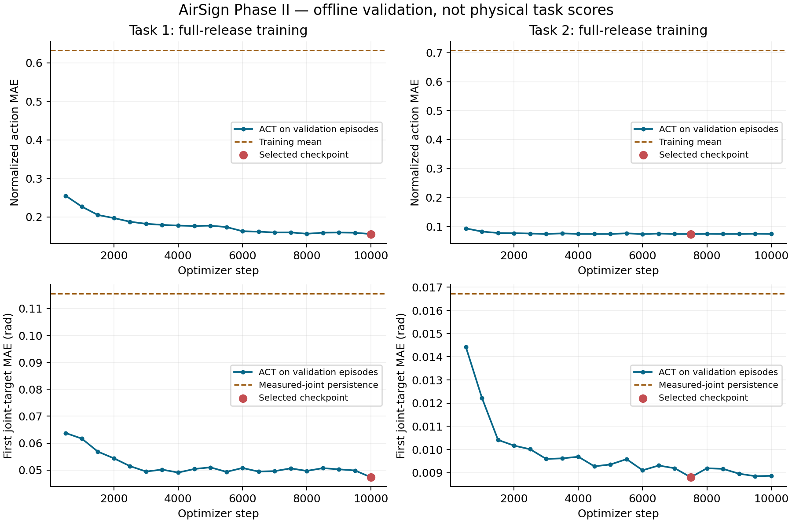

# AirSign Phase II offline results

These results measure held-out native action prediction. They are not competition scores or physical success rates.

| Task | Train / validation / test episodes | Selected step | Validation normalized MAE | Test normalized MAE | Test mean baseline |
|---|---|---:|---:|---:|---:|
| 1 | 40 / 5 / 5 | 10000 | 0.155784 | 0.212957 | 0.694985 |
| 2 | 190 / 24 / 24 | 7500 | 0.073164 | 0.075993 | 0.706836 |

Whole episodes were split before training, with training-only normalization. Checkpoint selection used validation data; the reserved test split did not select a model. Splits are within the supplied releases and do not establish cross-site generalization.

| Task | Test first joint-target MAE (native radians) | Worst joint channel MAE | Measured-joint persistence baseline | Test observations |
|---|---:|---:|---:|---:|
| 1 | 0.080257 | 0.487483 | 0.178487 | 15030 |
| 2 | 0.010698 | 0.027641 | 0.018950 | 6452 |

The joint baseline compares measured joints with recorded GELLO targets. It is an offline reference, not a measurement of physical servo accuracy. Per-dimension native errors, full source revisions, data hashes and export provenance are in `results.json`.

Task 1 has a material data-contract issue: part 2 episodes 5–8 hold the recorded right-joint-5 GELLO target at −2.8763 rad while the measured joint stays near −1.18 rad. Episodes 5 and 7 are in test; 6 and 8 are in training. The test first-action error for this channel is 0.4875 rad. The recording alone does not identify whether this is an unexecuted/disabled-controller target or another interface convention. This diagnosis was made after the fixed-model test; no episodes were removed, labels rewritten, or model retuned. See `task1-joint5-data-diagnosis.json`.

Normalized MAE averages every native action dimension, including constant channels; its scale differs between tasks. Task 1 includes recorded base-command feedback among its inputs, so low base-action error does not establish navigation. Joint errors above include both arms, even when one arm moves little.

The accompanying `software-validation.json` records policy/HTTP checks, fixed-checkpoint image diagnostics, wheel installation, pretrained perception loading and the separate MuJoCo actuator probe. Dataset manifests, run configurations and complete training metrics accompany this report.

Task 1 needs the assigned-route verifier and closed-loop evaluation of new routes; the ACT network itself has no route-instruction input. Task 2 needs pad-face and contact validation. Task 3 has a fresh feedback controller and optional object perception, with no demonstration checkpoint or measured task score.

All physical paths still need the actual Phase II transport, site calibration, task-specific grasp/outcome perception, and organizer or robot trials. No real deployment is claimed.
