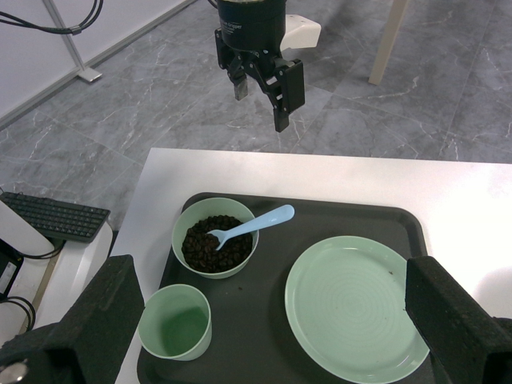
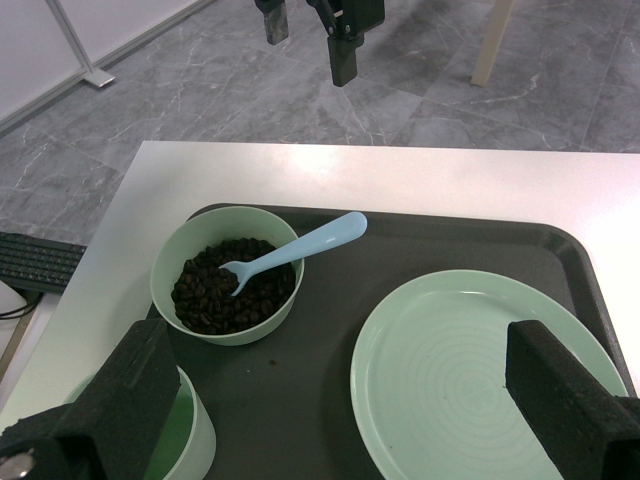

# AirSign | EBiM Task 3 Phase II technical progress report

**Session:** September 11-12, 2026 (Asia/Shanghai). **Team:** AirSign.
**Task:** Assisted Living & Feeding. **Result:** supervised hardware integration
and partial plate approach. No completed Task 3 stage is claimed.

## Contribution

This work connected a remote visual agent to the two-host Mobile FR3 Duo,
established measured-state access, resolved current wrist/arm mapping, and
executed bounded physical base and right-arm movements. The deliverable preserves
the exact final on-site control sources, a reusable operational skill, selected
images and raw measured-state/scan-registration records. A separate existing
feedback controller implements Task 3's service-cycle state machine through a
documented observation-to-action interface.

The source and report distinguish the implemented state machine from the
supervised physical run. A trajectory ending normally does not establish object
contact or task completion. The package makes no official score claim.

## Architecture and execution boundary

| Layer | Input / output | Status |
| --- | --- | --- |
| Visual supervision | Wrist RGB-D, measured arm poses, nominal robot geometry; individually reviewed waypoints | Used on site with agent-selected image regions |
| Native arm primitive | Measured initial pose + finite base-frame displacement; libfranka Cartesian velocity loop | Physically executed on the real-time host |
| Base primitive | Front/rear scan registration + finite right-turn target | Physically executed in bounded increments |
| Task 3 feedback program | Calibrated poses, Jacobians, navigation state and observed predicates; JSONL actions | Software tested; not connected end-to-end for this physical trial |
| Autonomous task perception / transport | Fresh object estimates, grasp outcomes, verified command mapping | Integration incomplete |

Native control runs locally on the robot's RT host. SSH carries supervision and
finite requests rather than individual servo samples. The arm primitive anchors
each step to a new measured pose, enforces real-time scheduling, limits each
request to 50 mm and 3-8 seconds, and monitors measured forces, collision flags,
joint speed/change, orientation change, travel and timing. It retains the
existing orientation and uses Cartesian impedance. It does not home, recover
faults, plan full swept-volume collision avoidance or close the gripper.

The finite session takes normal control ownership, activates FCI, reads state,
accepts separately reviewed steps, and releases ownership on exit. It was used
with site credentials entered interactively. No secrets are included. This is
an operator-supervised development tool, not certified safety control.

The feedback program has named navigation, grasp, lift, transport, placement,
feeding, bean-return and cleanup stages. Fresh observed predicates gate progress;
timeouts cannot certify a completed stage. It uses calibrated pose/Jacobian
servoing and holds or emits null actions when required evidence is missing or
stale. Its common 23-value output is not a verified Task 3 testbed transport.

## Physical observations

| Observation | Retained evidence | Interpretation |
| --- | --- | --- |
| 57.9578 degrees cumulative clockwise turn | Twenty scan-registration logs, steps 2-21 | Estimated chassis motion, not completed autonomous navigation |
| 0.176448 m net right-arm displacement | Before/final column-major measured O_T_EE | Endpoint displacement; not path length or motion of the plate |
| Five finite right-arm trajectory calls | Session notes and intermediate/final measured poses | The final call's stdout was not retained; no per-step success flag is inferred for it |
| Final right-arm mode Idle, current_errors empty | `evidence/arm/final.json` | State at the archived sample, not live readiness |
| Right gripper activated and opened | Session observation, documented register exchange | No plate-closing command or grasp verification |
| Plate remained on the table | Selected wrist views and incomplete approach | Contact, grasp and lift were not established |

The right-arm displacement in its arm-base frame was
`[0.010046422481, -0.105153590441, -0.141334891319]` m.
The turn estimate sums medians of the last 20 valid registration samples for
each finite turn; it is not external metrology. Native wheel feedback alone
was not used to infer independent chassis motion while steering.

*Right wrist RGB before the first arm translation. The other gripper is visible above the table.*

*Right wrist RGB after four translations, before the fifth. No final-step camera image is archived.*

## Perception and calibration

The two wrist cameras supplied 640x480 RGB and raw millimetre depth. Their current
serial-to-side mapping was checked with measured kinematics and cross-camera
feature projection. A live identity transform between the wrists was unsuitable
as physical hand-eye calibration. Raw depth and RGB used different intrinsics;
registration was handled explicitly during analysis. Nominal vendor gripper and
camera geometry supplemented measured arm transforms.

The configured flange-to-EE offset measured 174 mm along flange Z. Finger
contact geometry and full hand-eye calibration were not completed. Historical
plate estimates were expressed relative to nominal spine zero; the common
unknown spine offset does not establish absolute table height. The tool remained
tilted during approach. Thin-rim grasp orientation, contact and bimanual load
sharing remain future physical work.

## Assistance and data declarations

The operator initialized hardware, supervised the emergency stop, supplied
high-level directions and moved the desk in front of the robot before the arm
approach. A remote visual agent selected image/depth regions and reviewed each
finite step. This was not an uninterrupted autonomous trial. No robot-left arm
trajectory was executed during the plate approach.

For the current form's object-pose question, the appropriate declaration is
**Partly - see Notes**: the integration uses selected visual regions, nominal
calibration and externally supplied observations; end-to-end autonomous object
perception is not implemented. No simulator ground-truth poses were used to
drive these real-hardware steps. No Task 3 trajectory dataset was used for
training, and no Task 3 learned weights are claimed. Separate Task 1/2 training
results elsewhere in this repository are not Task 3 performance evidence.

## Reproduction and validation

`review.py` verifies source/evidence hashes and recomputes the two reported motion
metrics from retained data. `self-test` runs 31 existing controller/scoring tests
and three synthetic JSONL cases for stale, missing and malformed observations.
These tests check software behavior and evidence integrity only.

The CPU review container uses Python 3.12, NumPy 2.0.2 and pytest 8.4.2. It needs
no GPU, ROS, credentials or runtime Internet. The review Docker build/run could
not be executed in the available environment after departure and remains
unverified. Exact commands and hardware assumptions are in the adjacent README;
the validation record distinguishes commands run from commands proposed.

The native sources were compiled and exercised on site with the site's
libfranka 0.20.4 installation and real-time kernel. The new CMake packaging
has not been rebuilt on that host. Vendor models/libraries are external
dependencies, not bundled here. The source copies are byte-identical to the final
session versions, while offline packaging was added afterward.

## Remaining work and submission status

Before a runnable autonomous policy can be claimed, complete the live
perception/transport bridge, calibrate contact geometry and gripper conversion,
verify grasp/lift and bimanual behavior, then demonstrate each task stage from
the assigned initial conditions. A future agent-based route would also need an
explicit agent launcher, model/tool specification, credentials/network contract
and organizer acceptance; the present skill is not that launcher.

The current [Phase II form](https://github.com/EBiM-Benchmark/submissions/blob/main/.github/ISSUE_TEMPLATE/phase2-submission.yml)
requires a public pinned commit and working launch commands; the team's email
determines the deadline. The [submissions README](https://github.com/EBiM-Benchmark/submissions)
advertises a technical-report route, but no report template was listed in the
current chooser. Acceptance of this progress report for Phase II must be
confirmed. Until then, the package is a reviewable technical report and code
archive, not a certified runnable-policy entry.
